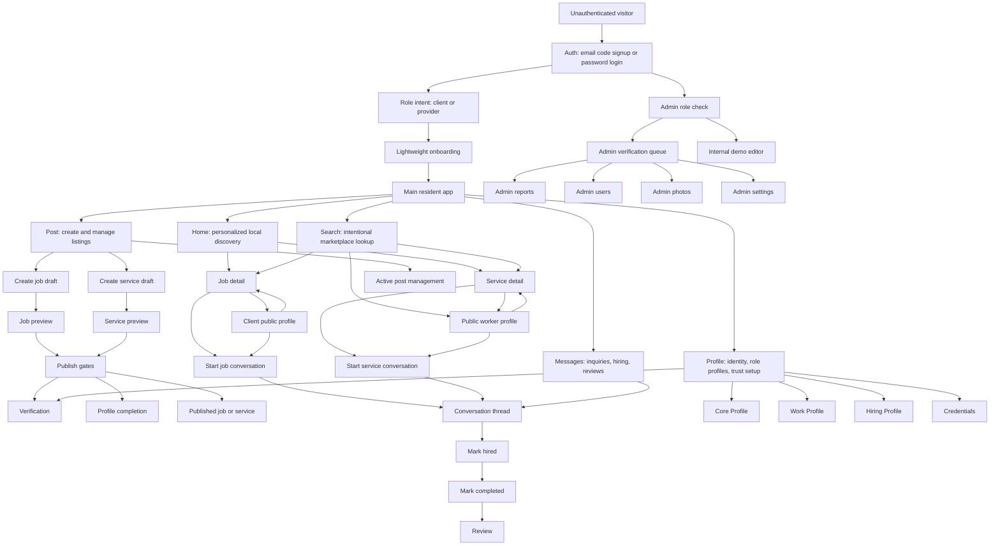
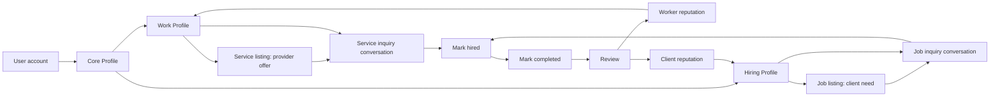
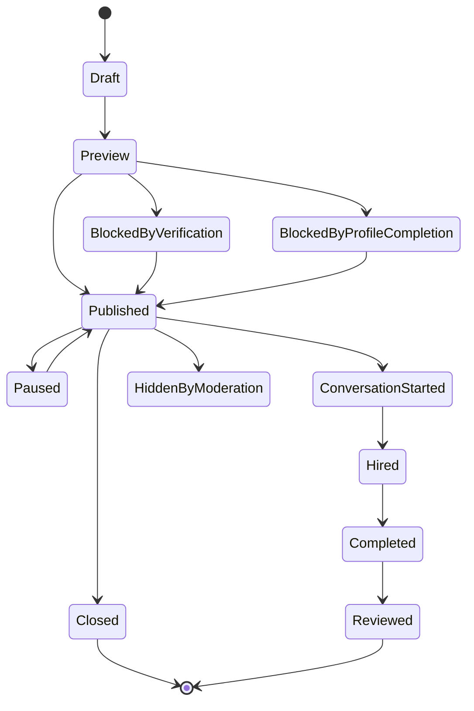
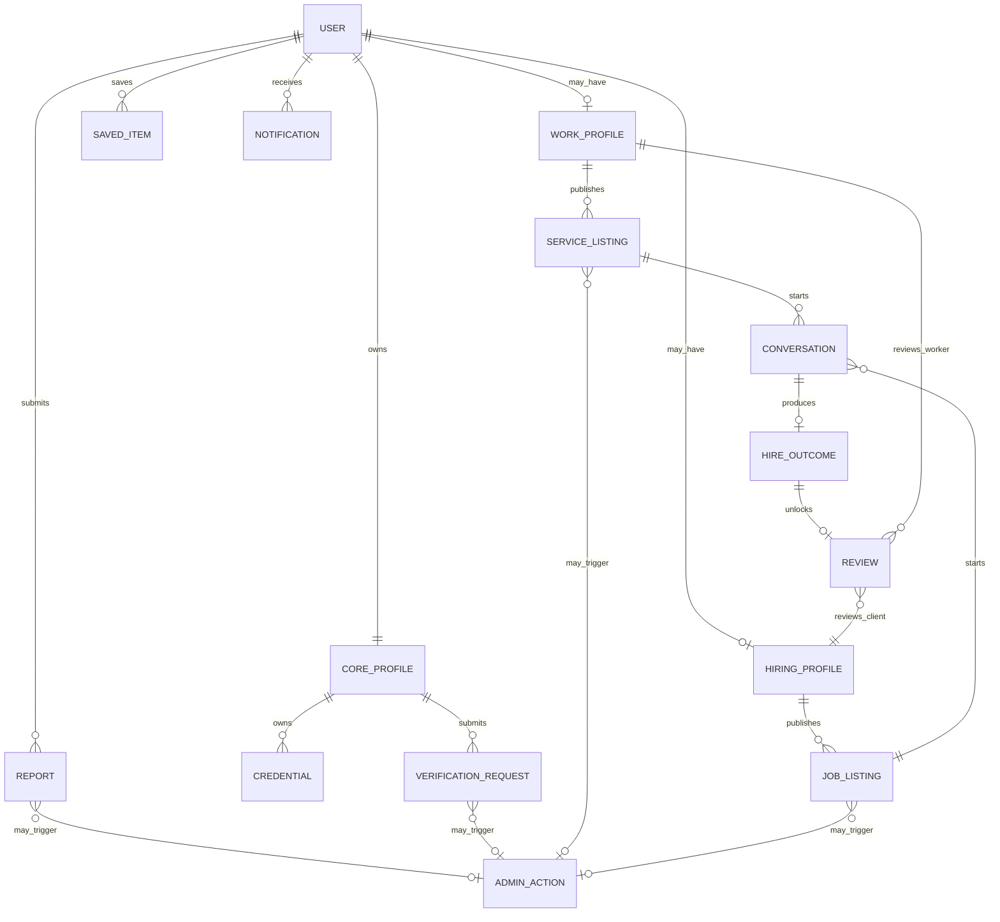

# Konektado Product Architecture and Information Architecture Audit

Date: 2026-06-01  
Scope: Product, UX, marketplace, navigation, information architecture, and mental model review before public launch.  
Non-scope: Code quality, implementation refactors, database changes, performance, and security penetration testing.

## Source Material Reviewed

Konektado sources:

- Product and architecture docs in `docs/00-project-brief.md`, `docs/01-product-scope.md`, `docs/03-feature-map.md`, `docs/04-user-flows.md`, `docs/05-data-model.md`, `docs/06-api-contracts.md`, `docs/07-auth-and-permissions.md`, `docs/08-design-system.md`, `docs/09-development-rules.md`, `docs/10-ai-instructions.md`, `docs/11-decision-log.md`, `docs/12-coding-kickoff.md`, `docs/14-marketplace-fixes-backlog.md`, `docs/search-discovery-ux-audit.md`, `docs/product-ux-detail-screen-audit.md`, and `docs/personalization-for-you-feed.md`.
- App routes under `app/`, shared UI under `components/`, services under `services/`, and shared marketplace/profile/verification types under `types/`.
- Konektado Figma MCP metadata for the established design system file. The available top-level Figma page is `Konektado DS v1`, which contains design primitives, dashboard/new-user references, feed card patterns, and responsive mobile layout notes.

Marketplace comparison references:

- [Facebook Marketplace Help](https://www.facebook.com/help/1713241952104830), including local buy/sell, search/category browsing, saves, profiles, and ratings.
- [Facebook Marketplace saved items](https://www.facebook.com/help/iphone-app/904464579676902/) and [ratings](https://www.facebook.com/help/915385548593204/).
- [Upwork proposal review](https://support.upwork.com/hc/en-us/articles/18010402882195--Review-job-proposals), [direct messages](https://support.upwork.com/hc/en-us/articles/17936213468691--Use-Direct-Messages), and [messages](https://support.upwork.com/hc/en-us/articles/211067768-How-to-use-Upwork-Messages).
- [Fiverr Creating a Gig](https://help.fiverr.com/hc/en-us/articles/360010451397-Creating-a-Gig) and [Receiving an order](https://help.fiverr.com/hc/en-us/articles/360010543477-Receiving-an-Order).
- [Taskrabbit hire flow](https://support.taskrabbit.com/hc/en-us/articles/210861763-How-Do-I-Hire-a-Tasker), [choosing a Tasker](https://support.taskrabbit.com/hc/en-us/articles/360050012971-How-Do-I-Know-Which-Tasker-Is-Best-for-My-Task), and [task chat](https://support.taskrabbit.com/hc/en-gb/articles/46260491617691-How-Do-I-Contact-My-Tasker).
- [Nextdoor address verification](https://help.nextdoor.com/articles/en_GB/Knowledge/How-to-verify-your-address?other.ArticleDetail.getArticles=1&r=6), used as a neighborhood-first trust reference.
- [LinkedIn service provider pages](https://www.linkedin.com/help/linkedin/answer/a548384) and [shopping for services](https://www.linkedin.com/help/linkedin/answer/a567616).

## 1. Executive Summary

Konektado has become a barangay-first services marketplace with three strong ideas:

1. Residents browse before they are verified.
2. Verified residents can participate through Work Profiles, Hiring Profiles, Jobs, Services, Messages, and Reviews.
3. Barangay administrators provide the trust layer through verification and moderation.

The current architecture is directionally sound. It is not trying to be a generic gig marketplace. Its most distinctive product position is: a verified local community marketplace where residents can safely discover trusted workers and local jobs, then coordinate through messages without in-app payments.

The biggest launch-readiness issue is not a missing feature; it is conceptual overlap. The app now has multiple centers of gravity:

- The resident as a verified person.
- The Work Profile as a worker identity.
- The Hiring Profile as a client identity.
- The Service listing as an offer.
- The Job listing as a need.
- The conversation as the hiring workspace.

Those objects are all valid, but the product does not always make their ownership and relationships obvious. A first-time resident may wonder whether they are hiring a person, a service, or a job poster. A provider may wonder whether their Work Profile or Service listing is the real public surface. A client may wonder whether posting a Job, messaging a worker, or creating a Hiring Profile is the primary path. An admin may see verification, photos, reports, users, and demo content as separate tools rather than one trust operations system.

Before public launch, Konektado should tighten the marketplace mental model:

- Core Profile owns identity and barangay trust.
- Work Profile owns provider reputation and capability.
- Hiring Profile owns client reputation and hiring preferences.
- Service listings are provider-owned offers.
- Job listings are client-owned needs.
- Conversations are listing-scoped coordination spaces.
- Hire, completion, and review are outcomes of a conversation tied back to a Job, Service, and role-specific profile.
- Saved items, reports, and notifications are marketplace activity, not identity.

The product should preserve the barangay-first model. It should not copy Upwork contracts, Fiverr packages, TaskRabbit payments, or Facebook's open marketplace looseness. The strongest future shape is a lightweight, local, verified, message-first marketplace with role-specific reputation and clear listing ownership.

## 2. Current Product Architecture Diagram

### Product Architecture Interpretation

Konektado is currently a hybrid of:

- A local discovery feed like Facebook Marketplace and Nextdoor.
- A provider service catalog like Fiverr and LinkedIn Services.
- A client job board like Upwork.
- A task coordination workflow like TaskRabbit, but without booking/payment.
- A barangay-admin trust layer that none of the comparison products provide in the same local civic form.

This hybrid is viable, but only if the hierarchy is explicit:

Resident -> Profile -> Role Profile -> Listing -> Conversation -> Hire -> Review.

At present, the hierarchy is partially implied by routes and services, but the visible product sometimes presents Services, Workers, Profiles, Jobs, and Posts as peers.

## 3. Current Information Architecture Diagram

```mermaid
graph TD
  ROOT["App root"]

  ROOT --> AUTH["Auth"]
  AUTH --> AUTH1["Landing / auth index"]
  AUTH --> AUTH2["Register"]
  AUTH --> AUTH3["Create password"]
  AUTH --> AUTH4["Login"]
  AUTH --> AUTH5["Forgot password"]
  AUTH --> AUTH6["Role intent"]

  ROOT --> ONB["Onboarding"]
  ONB --> ONB1["Intent"]
  ONB --> ONB2["Job / services preferences"]
  ONB --> ONB3["Location"]
  ONB --> ONB4["Review"]
  ONB --> ONB5["Complete"]
  ONB --> LEG1["Legacy certifications"]
  ONB --> LEG2["Legacy onboarding verification"]

  ROOT --> TABS["Resident tabs"]
  TABS --> HOME["Home"]
  TABS --> SEARCH["Search"]
  TABS --> POST["Post"]
  TABS --> MSGS["Messages"]
  TABS --> PROFILE["Profile"]

  HOME --> DETAIL1["Job detail"]
  HOME --> DETAIL2["Service detail"]
  SEARCH --> DETAIL1
  SEARCH --> DETAIL2
  SEARCH --> DETAIL3["Worker public profile"]
  DETAIL1 --> DETAIL4["Client public profile"]
  DETAIL2 --> DETAIL3
  DETAIL3 --> DETAIL2
  DETAIL4 --> DETAIL1

  POST --> CREATE1["Create job"]
  CREATE1 --> PREV1["Job preview"]
  POST --> CREATE2["Create service"]
  CREATE2 --> PREV2["Service preview"]
  POST --> ACTIVE["Active posts"]
  POST --> RENEW["Renew post"]

  MSGS --> THREAD["Conversation thread"]
  THREAD --> THREADD["Conversation details"]
  THREADD --> REVIEW["Review dialog"]

  PROFILE --> PCOMP["Complete profile"]
  PROFILE --> CREDS["Credentials"]
  PROFILE --> SETTINGS["Settings"]
  PROFILE --> VERIFY["Verification"]
  PROFILE --> NOTIF["Notifications"]

  ROOT --> ADMIN["Admin"]
  ADMIN --> AV["Verifications"]
  AV --> AVD["Verification detail"]
  ADMIN --> REP["Reports"]
  ADMIN --> USERS["Users"]
  USERS --> USERD["User detail"]
  ADMIN --> PHOTOS["Photos"]
  PHOTOS --> PHOTOD["Photo detail"]
  ADMIN --> ASET["Settings"]

  ROOT --> INTERNAL["Internal"]
  INTERNAL --> ILOGIN["Internal login"]
  INTERNAL --> IDEMO["Demo editor"]
```

### Screen-by-Screen Inventory

This inventory treats screens as product states. Some routes are user-facing destinations; others are admin/internal utilities or legacy states that should be removed from the launch mental model.

| Area | Screen | Purpose | Target user | Inputs | Outputs | Dependencies | Information ownership |
|---|---|---|---|---|---|---|---|
| Auth | Auth landing | Start account/login flow | First-time resident, returning resident | Email, path selection | Register/login route | Supabase Auth | Identity |
| Auth | Register | Create account with email-code flow | First-time resident | Email, OTP | Authenticated account | `auth.service`, Supabase email templates | Identity |
| Auth | Create password | Set reusable password after email verification | New resident | Password | Password login readiness | Supabase Auth | Identity |
| Auth | Login | Return to account | Returning resident, admin | Email, password | Session | Supabase Auth | Identity |
| Auth | Forgot password | Recover access | Returning resident | Email | Reset flow | Supabase Auth | Identity |
| Auth | Role intent | Select initial marketplace intent | New resident | Client/provider intent | Onboarding branch | `onboarding.service`, `user_preferences` | Preference |
| Onboarding | Intent/start | Lightweight setup entry | New resident | Role intent, current step state | Onboarding progress | `onboarding-context` | Preference |
| Onboarding | Job/services preference | Capture offered or needed services | New client/provider | Service categories, custom entries | Preference payload | Service taxonomy | Preference, Capability |
| Onboarding | Location | Capture barangay/local context | New resident | Public location area, address fragments | Core profile/location state | Profile/onboarding services | Identity, Preference |
| Onboarding | Review | Confirm lightweight setup | New resident | Draft onboarding state | Completion action | `onboarding.service` | Preference |
| Onboarding | Complete | Finish setup and enter app | New resident | Completion status | Main app access | Root route guard | Marketplace Activity |
| Onboarding legacy | Certifications | Old provider proof collection | Provider, likely legacy/orphan | Credential fields/files | Certification/credential payload | Old onboarding flow | Trust, Capability |
| Onboarding legacy | Verification | Old verification upload | Resident, likely legacy/orphan | ID/selfie/address proof | Verification request | Old onboarding flow | Trust |
| Resident tabs | Home | Passive discovery and recommendations | Resident browsing locally | Preferences, verification/setup state, saved status, filters | Recommended jobs/services, setup nudges, saved toggles | `home-feed.service`, `job.service`, `service-profile.service`, `saved-items.service`, `profile-completion.service` | Marketplace Listing, Marketplace Activity, Preference |
| Resident tabs | Search | Intentional lookup across jobs/services/workers | Client hiring worker, provider finding jobs | Query, category, service, rate, location, availability, certification/verified filters | Search results, reports, saved toggles | `searchJobs`, `searchServices`, preferences, saved items, reports | Marketplace Listing, Marketplace Activity |
| Resident tabs | Post | Creator center for drafts and active listings | Provider, client | Profile state, verification state, drafts, listings | Create job/service entry, drafts, active posts | `job-draft.service`, `service-draft.service`, `job.service`, `service-profile.service` | Marketplace Listing, Marketplace Activity |
| Resident tabs | Messages | Inbox and hiring coordination hub | Verified resident with conversations | Conversation previews, filters | Threads, unread/message requests, hiring context | `conversation.service`, notifications, verification | Communication, Marketplace Activity |
| Resident tabs | Profile | Personal profile hub and role profile dashboard | Resident | Profile completion, jobs/services, credentials, reviews | Work/Hiring profile views, setup actions, public preview links | `profile-completion.service`, `credential.service`, `review.service`, jobs/services | Identity, Trust, Capability, Marketplace Activity |
| Detail | Job detail | Explain client need and let verified providers message | Provider, browsing resident, owner | Job id, viewer profile, saved/report state | Message client, manage own post, report, view client | `job.service`, `conversation.service`, reports | Marketplace Listing, Communication |
| Detail | Service detail | Explain provider offer in context and let clients inquire | Client, browsing resident, owner | Service id, viewer profile, saved/report state | Message provider, view worker profile | `service-profile.service`, `worker-profile.service`, conversations | Marketplace Listing, Capability, Communication |
| Detail | Worker public profile | Person-level provider trust and services | Client evaluating worker | Worker id, optional source service | Service inquiry, service navigation, trust summary | `worker-profile.service`, conversations | Identity, Trust, Capability, Marketplace Listing |
| Detail | Client public profile | Person-level client trust and open jobs | Provider evaluating client | Client id, optional source job | Job inquiry, job navigation, trust summary | `client-profile.service`, conversations | Identity, Trust, Marketplace Listing |
| Creation | Create job | Draft a client-owned need | Client / resident hiring help | Service needed, title, description, photos, location, budget, schedule, requirements, message settings | Private job draft or preview state | `job-draft.service`, photo service, taxonomy | Marketplace Listing |
| Creation | Job preview | Review publishable job | Client | Draft state, verification/profile completion | Published job or gate to verification/profile completion | `job.service`, draft delete, profile completion | Marketplace Listing, Trust |
| Creation | Create service | Draft provider-owned offer | Service provider | Category/service, title, description, photos, rate, availability, experience, certification metadata, tags, message settings | Private service draft or preview state | `service-draft.service`, photo service, taxonomy | Marketplace Listing, Capability |
| Creation | Service preview | Review publishable service | Service provider | Draft state, verification/profile completion | Published service or gate to verification/profile completion | `service-profile.service`, draft delete, profile completion | Marketplace Listing, Trust, Capability |
| Creation | Active posts | Manage owned active jobs/services | Client/provider | Owned listings, status | Open/edit/manage listings | Jobs/services services | Marketplace Activity, Marketplace Listing |
| Creation | Renew post | Placeholder renewal/update state | Listing owner | Existing listing context | Return/manage post | Post management | Marketplace Activity |
| Communication | Conversation thread | Coordinate about a job or service | Verified matched residents | Conversation id, messages, text/photos, context card | Messages, mark hired, navigation to listing/profile | `conversation.service`, realtime previews, notifications | Communication, Marketplace Activity |
| Communication | Conversation details | Manage conversation outcome and safety | Verified conversation participants | Conversation id, status, report/delete/archive actions | Mark hired, complete job, review, report, archive/delete | `conversation.service`, `review.service`, reports | Communication, Marketplace Activity, Trust |
| Profile | Complete profile | Edit Core, Work, and Hiring profiles | Resident | Identity/contact/location, profile photo, offered/needed services, bio, rates, service areas | Completed role profile state | Profile completion services, taxonomy, photo service | Identity, Preference, Capability |
| Profile | Credentials | Add optional trust boosters | Provider/resident | Credential title/type/file/status | Credential record, admin review surface | `credential.service` | Trust, Capability |
| Profile | Settings | Account/profile utility hub | Resident | Current profile/session | Profile edit, verification, credentials, manage posts, logout | Auth/profile services | Identity, Trust, Marketplace Activity |
| Profile | Verification | Submit barangay verification | Resident | Legal name/address/contact, files, status | Verification request | `verification.service`, `FigmaVerificationFlow` | Trust, Identity |
| Utility | Notifications | See app notifications | Resident | Notification records | Read/open related activity | `notification.service` | Marketplace Activity, Communication |
| Utility | Modal | Generic Expo/modal route | Resident/developer | Route params | Modal content | Expo router | Marketplace Activity |
| Admin | Verification queue | Review resident verification requests | Barangay admin | Request list, filters | Open review, status queue | `admin.service`, verification status | Administration, Trust |
| Admin | Verification detail | Approve/reject/request correction | Barangay admin | Request id, files, profile details, decision notes | Verification status update | `admin.service`, verification files | Administration, Trust, Identity |
| Admin | Reports | Moderate reported users/listings/messages | Barangay admin | Report list, status filters | Status transitions, moderation action | `report.service`, admin services | Administration, Trust |
| Admin | Users | Inspect public user/activity records | Barangay admin | Search, filters | User detail, activity overview | `admin-user.service` | Administration, Identity, Marketplace Activity |
| Admin | User detail | Review one user in context | Barangay admin | User id, public profile, activity, reports, latest verification | Admin decisions/navigation | `admin-user.service`, admin services | Administration, Trust |
| Admin | Photos | Moderate public marketplace/profile photos | Barangay admin | Public photo queue, filters | Hide/flag/clear photo | `admin-photo.service`, content visibility | Administration, Trust |
| Admin | Photo detail | Decide on one public photo | Barangay admin | Photo id, owner/listing context | Moderation status update | `admin-photo.service` | Administration, Trust |
| Admin | Settings | Admin account/settings shell | Barangay admin | Admin session | Account/context display | Admin shell/auth | Administration, Identity |
| Internal | Internal login | Gate internal tooling | Internal demo operator/admin | Internal credentials/session | Demo editor access | Internal demo service | Administration |
| Internal | Demo editor | Curate demo/presentation content | Internal demo operator/admin | Demo users, listings, verification files, photos | Demo data changes | `internal-demo-editor.service` | Administration, Marketplace Listing |

### IA Strengths

- The five-tab resident shell is easy to understand: Home, Search, Post, Messages, Profile.
- Home and Search now have distinct purposes: passive personalized discovery vs intentional lookup.
- Post has matured into a useful creator center rather than a single form button.
- Messages owns the hiring lifecycle better than an application/proposal system would for this MVP.
- Profile correctly houses identity, trust, and role setup.
- Admin tools map to the key launch risks: verification, reports, users, and public photos.

### IA Weaknesses

- Saved items exist as a cross-marketplace action, but there is no obvious destination for saved Jobs/Services/Workers.
- Worker profile and Service detail are too close in presentation. A Service route currently renders mostly as a public worker profile with selected service context.
- Reviews appear profile-level in the Profile tab, but hiring outcomes are job/conversation-level. This weakens role-specific trust.
- Legacy onboarding verification/certification routes conflict with the current lightweight onboarding decision, even if they are no longer primary.
- Admin Photos is an important moderation tool but is not represented in the admin bottom navigation alongside Verifications, Reports, Users, and Settings.
- Internal demo editor is appropriately hidden, but it belongs conceptually under internal operations, not barangay administration.

## 4. Marketplace Data Ownership Map

### Data Classification

| Data class | Owns | Current examples | Should be visible to | Product rule |
|---|---|---|---|---|
| Identity | Core Profile / account | Legal name, display name, profile photo, email, phone, public location label, private address fragments | Owner; limited public identity; admins for verification | Identity should not be duplicated across Work/Hiring/Listings except as denormalized display summaries. |
| Preference | User preferences / role setup | Initial intent, offered services, needed services, delivery mode, service categories, search/feed preferences | Owner; recommendation systems | Preferences drive Home/Search and onboarding, but should not be mistaken for published offers. |
| Trust | Verification, credentials, moderation, reviews | Barangay verification status, credentials, public photo review, reports, review ratings | Public summary; private files to owner/admin only | Trust must be role-aware where it affects hiring decisions. |
| Capability | Work Profile and Service listings | Offered services, experience level, rate range, availability, credentials, bio, service area | Public clients, search/feed | Capability lives on Work Profile; Service listings package capability into specific offers. |
| Marketplace Listing | Jobs and Services | Job title/need/budget/schedule/location; Service title/rate/availability/photos | Public only after owner is verified and profile-complete | Jobs are needs; Services are offers. Drafts are private. |
| Marketplace Activity | Saved items, drafts, active posts, notifications, reports, status history | Saved jobs/providers, draft jobs/services, active posts, unread counts, listing status | Owner; admins where safety-relevant | Activity needs a visible home so users can resume intent. |
| Communication | Conversations and messages | Job/service inquiry, message text, attachments, hired/completed state | Participants; admins only through report/moderation paths | Conversations should be listing-scoped, not generic social chat. |
| Administration | Admin review/actions/demo content | Verification decisions, moderation actions, user inspection, demo editor | Barangay admins; internal operators for demo | Admin data should be operational, auditable, and separated from public resident UX. |

### Object Ownership

| Object | Primary owner | Secondary actors | Current role in product | Ownership risk |
|---|---|---|---|---|
| User account | Resident | Admin can inspect status | Authentication and base identity | Low |
| Core Profile | Resident | Admin verifies identity | Shared identity for Work/Hiring | Medium: public/private identity fields need clear boundaries. |
| User Preferences | Resident | Recommendation systems | Onboarding and feed/search personalization | Medium: offered/needed preferences can look like published Services/Jobs. |
| Work Profile | Provider/resident | Clients view; admin moderates indirectly | Provider-facing public identity | Medium: overlaps with Service detail and worker route. |
| Hiring Profile | Client/resident | Providers view; admin moderates indirectly | Client-facing public identity | Medium: less visible than Work Profile despite being crucial for provider trust. |
| Credential | Resident/provider | Admin reviews | Optional trust booster | Medium: credential proof is private, credential summary may be public. |
| Verification Request | Resident | Barangay admin | Trust gate for interaction | Low conceptually; high operational importance. |
| Job Draft | Client/resident | None | Private creation state | Low |
| Job Listing | Client/resident | Providers inquire; admin moderates | Public need | Medium: job status and hire outcome must stay clear. |
| Service Draft | Provider/resident | None | Private creation state | Low |
| Service Listing | Provider/resident | Clients inquire; admin moderates | Public offer | High: currently can collapse into Worker Profile mentally. |
| Saved Item | Resident | None | Intent bookmark | High: exists as action but not as destination. |
| Conversation | Participants | Admin only via reports/moderation | Coordination workspace | Medium: hire/review status lives here, but users may think it belongs on listings. |
| Hire | Client/job owner | Worker/provider | Outcome marker | High: there is no full hiring object; it is a conversation/job status. |
| Review | Reviewer/reviewee | Admin via reports if needed | Reputation after completion | High: role-specific reputation is not clearly separated. |
| Report | Reporter | Admin | Safety escalation | Low |
| Public Photo | Owner/listing owner | Admin | Visual trust/content | Low, but admin nav discoverability is medium risk. |
| Demo Content | Internal operator | Admin-like internal tools | Presentation/local demo | Medium: must stay distinct from real admin/product data. |

### User -> Profile -> Service -> Job -> Message -> Hire -> Review Map

### Current Deviations From the Ideal Map

- The product sometimes treats Service and Worker as interchangeable. A Service detail route often behaves like a Worker public profile with selected-service context.
- The Hiring Profile is architecturally important, but it is less prominent than Work Profile in discovery and trust evaluation.
- Saved items sit outside the map even though saving is a core marketplace behavior.
- Reviews are created after a job/conversation, but the visible Profile tab can make them appear profile-wide rather than role/context-specific.
- Credentials are optional trust boosters, but older onboarding screens can imply they are part of first-run provider onboarding.
- Verification is conceptually a Core Profile trust gate, but it appears as a repeated action barrier across Home, Post, Messages, details, and profile setup.

## 5. UX Consistency Findings

### What Is Working

- The visual system is generally cohesive: soft neutral backgrounds, rounded marketplace cards, clear badges, and bottom-tab mobile navigation.
- The app avoids an "application" mental model and correctly uses messages plus Mark Hired for local coordination.
- Creation flows support drafts and previews, which is important because unverified users can safely prepare listings before verification.
- Profile setup is now more flexible: one account can eventually support both Work and Hiring profiles.
- Search and Home have a clean division of labor.
- Admin screens use a consistent queue/detail/moderation structure.

### UX Inconsistencies

1. Services vs Workers
   - User-facing copy says Services, but search/card implementation still uses worker concepts in places.
   - A client looking for help may see a Service offer, a Worker card, and a Worker profile as slightly different forms of the same thing.
   - Recommendation: preserve "Services" as the discovery object and use Worker Profile as supporting identity.

2. Profile vs Listing
   - Work Profile contains capability; Service listing contains a specific offer.
   - Hiring Profile contains client trust; Job listing contains a specific need.
   - The UI often presents these together, which is good, but not always in a hierarchy.
   - Recommendation: every detail page should make clear whether the user is viewing a person, an offer, or a need.

3. Verification vs Profile Completion
   - The gate logic is correct, but the UX surfaces it in many places with slightly different framing.
   - Recommendation: define one visible eligibility model: "Browse", "Draft", "Interact", "Publish", "Review".

4. Public trust badges
   - Docs previously constrained badge usage on detail pages, while public profile components still show verified badges.
   - Recommendation: decide the badge rules by surface. Public profiles may show trust summary; listing cards should avoid repetitive badge noise.

5. Saved behavior
   - Users can save items, but they do not have a clear "where did it go?" destination.
   - This is a classic marketplace expectation. Facebook Marketplace makes saved items a first-class behavior; Konektado needs an equivalent collection even if it is not a tab.

6. Legacy onboarding residue
   - Current docs say first onboarding should not collect verification uploads or credentials.
   - Legacy certification/verification onboarding routes still exist in the IA and can confuse future implementation and QA.

7. Admin tool discoverability
   - Verification, reports, users, and settings are in the admin shell.
   - Photo moderation exists but is secondary despite being a public safety function.

8. Post terminology
   - "Post" is a good tab label for locals, but inside the flow the product alternates between post, job, listing, service listing, draft, and active posts.
   - Recommendation: use "Post" as the creation hub; use "Job post" and "Service listing" as the two object types.

## 6. Navigation Findings

### Resident Navigation

| Tab | Current mental model | Launch-readiness assessment | Recommended role |
|---|---|---|---|
| Home | "What is happening near me?" | Strong | Passive discovery, recommendations, setup nudges, recently relevant local marketplace items. |
| Search | "I know what I need or what work I want." | Strong after recent decisions | Structured lookup across Jobs and Services, with filters and category browsing. |
| Post | "I want to create or manage something." | Strong but overloaded | Creator center for Job posts, Service listings, drafts, and active post management. |
| Messages | "I am coordinating with someone." | Strong | Inbox, inquiries, hiring state, completion, review prompts. |
| Profile | "Who am I here, and am I ready?" | Strong but dense | Core identity, Work/Hiring profiles, verification, credentials, settings, public previews. |

### Navigation Gaps

1. No Saved destination
   - Save is a marketplace action with no obvious retrieval path.
   - Recommended placement: Profile -> Saved, Home header utility, or Search result utility. It does not need to be a sixth tab.

2. No explicit Activity hub
   - Drafts live in Post; active posts live in Post; saved items have no home; conversations live in Messages; notifications are a utility route.
   - Recommended future grouping: "Activity" as a conceptual layer, not necessarily a tab.

3. Search objects need clearer labels
   - If Search has modes for Jobs and Services, cards should not make the Services side feel like a separate Worker directory unless intentionally framed as "Service providers".

4. Profile is carrying too much setup weight
   - Verification, credentials, work profile, hiring profile, settings, public preview, and listings all converge in Profile.
   - This is acceptable for MVP, but future growth should separate "Account and trust" from "Public profiles" if the surface becomes too dense.

5. Admin Photos should be easier to reach
   - Public photo moderation is safety-critical for a marketplace with user-uploaded images.
   - Recommendation: include Photos in admin navigation or surface it as a moderation queue count inside Reports.

6. Internal demo editor should remain out of public/admin IA
   - It is useful for demos, but should stay clearly internal.

### Navigation Comparison

- Facebook Marketplace anchors on listings, saves, search, categories, messaging, and profile trust. Konektado matches listing/message behavior but lacks saved retrieval.
- Upwork anchors on jobs, proposals, freelancer profiles, contracts, and messages. Konektado intentionally avoids proposals/contracts, so Messages must carry more clarity.
- Fiverr anchors on Gig pages as the sellable unit. Konektado's Service listings should become more clearly "the offer" rather than only a worker profile context.
- TaskRabbit anchors on category -> task details -> tasker -> schedule -> chat. Konektado has category/service and chat, but no formal schedule/booking object by design.
- Nextdoor anchors on local identity and neighborhood trust. Konektado should keep this as its strongest differentiator.
- LinkedIn Services anchors on professional profile + service page + request/proposal. Konektado can learn from profile/service separation without adopting formal proposals.

## 7. Profile Architecture Findings

### Current Profile Model

Konektado currently has four overlapping profile-like constructs:

1. Account identity
   - Auth session, email, role.
2. Core Profile
   - Shared resident identity, profile photo, contact preferences, barangay/location, verification status.
3. Work Profile
   - Provider headline, bio, offered services, service area, availability, rate range, credentials, service listings, reviews from clients.
4. Hiring Profile
   - Client headline, bio, needed services, schedule/budget preferences, job history, reviews from workers.

This is the right conceptual split for a dual-sided local marketplace. The issue is that the public surfaces and review model do not yet fully enforce the split.

### Profile Strengths

- One account can support both worker and client behavior, which matches real barangay life.
- Core Profile is the correct place for verification and shared identity.
- Work and Hiring profile completion makes publishing more trustworthy than a pure free-form listing system.
- Public Worker and Client profiles create needed trust before messaging.
- Credentials are optional trust boosters, which avoids overburdening first-run onboarding.

### Profile Architecture Risks

1. Role-specific reputation is not clear enough
   - Reviews should be interpreted differently depending on whether the resident acted as a worker or a client.
   - Current profile display risks showing review data as generic person reputation.
   - Recommendation: split or filter reviews by role context: "Reviews from clients" vs "Reviews from workers" with clear source job/service.

2. Work Profile vs Service listing ownership is blurred
   - A Work Profile says what a provider can do.
   - A Service listing says what the provider is currently offering.
   - The service detail route should feel like an offer page first, with the worker profile as supporting proof.

3. Hiring Profile is under-leveraged
   - Client public profile helps providers assess safety and seriousness, but discovery is mostly focused on jobs/services/workers.
   - Recommendation: every Job detail should strengthen the client summary enough that providers know who they are messaging.

4. Profile completion and preferences overlap
   - User preferences, Work Profile offered services, Hiring Profile needed services, Service listing categories, and Job service_needed can repeat the same service taxonomy.
   - Recommendation: define preferences as private personalization, role profiles as public capability/need summary, and listings as individual marketplace objects.

5. Custom services require a clear review path
   - Custom "Other" values can appear in onboarding/profile/listing flows.
   - Recommendation: store custom service labels with source and review status so admins and search can normalize them later.

6. Verification and credentials can be confused
   - Verification proves local resident identity.
   - Credentials prove job/service-related trust.
   - Recommendation: keep these visually distinct and avoid collecting credentials in first-run onboarding.

## 8. Marketplace Findings

### Current Marketplace Model

Konektado now has two complementary listing types:

- Job: a client-owned need. A provider finds it and messages the client.
- Service: a provider-owned offer. A client finds it and messages the provider.

That is the right model for a barangay services marketplace. It lets either side create supply or demand, while avoiding a heavy application system.

### Marketplace Strengths

- The app avoids "Apply" as the primary flow, which matches the local, informal service context.
- Message-first coordination is a good fit for small jobs, household help, errands, repairs, tutoring, and local service work.
- Drafts let residents prepare listings before verification.
- Verification gates publishing and messaging, preserving trust without blocking browsing.
- Search and Home can support both sides of the marketplace.
- Admin moderation exists for the core safety surfaces: identity verification, reports, users, and public photos.

### Marketplace Weaknesses

1. Service detail is not distinct enough from Worker Profile
   - A Service should answer: "What exactly is being offered, at what rate, with what availability, and how do I inquire?"
   - A Worker Profile should answer: "Who is this person, what else do they offer, and can I trust them?"

2. Job detail needs stronger client trust framing
   - Providers deciding whether to respond need the client equivalent of worker trust: verified resident, hiring history, completed jobs, reviews from workers, and clear location/scope.

3. Hire state is under-modeled
   - The product has Mark Hired, Mark Completed, and Review, but no first-class "engagement" object.
   - For MVP this is acceptable, but the UX must make clear that the conversation thread is the engagement workspace.

4. Saved items are product debt
   - Saved actions are implemented, but the mental model is incomplete without a Saved collection.

5. Recommendations need transparent enough reasons
   - The For You feed exists and can use preferences, service match, and local relevance.
   - Users should see light match reasons such as "Matches services you need", "Near your area", or "Similar to saved items" when reliable.

6. Marketplace status vocabulary needs consolidation
   - Draft, active, published, closed, completed, hired, paused, deactivated, renewed, hidden, flagged, and report statuses should be grouped by object.
   - Recommendation: each listing type should have a visible lifecycle.

### Listing Lifecycle Recommendation

For Jobs, "Hired" belongs to the job/conversation outcome. For Services, "Hired" should still be tied to a job-like engagement or conversation context, not the whole service listing.

### Comparison Against Common Marketplace Patterns

| Platform | Common pattern | Konektado similarity | Konektado should not copy | Useful lesson |
|---|---|---|---|---|
| Facebook Marketplace | Local listing discovery, save listings, message sellers, ratings/profiles | Local browsing, listing details, saves, message-first coordination | Loose trust model and generic buy/sell breadth | Make saved items retrievable and listing ownership obvious. |
| Upwork | Job posts, proposals, freelancer profiles, contracts, workrooms, payments, reviews | Job posts, profiles, messages, reviews | Proposal/application system, contracts, platform payments | Keep project context visible inside messages; separate worker/client reputation. |
| Fiverr | Seller-created Gig as offer page, packages, orders, requirements, reviews | Service listings as provider offers | Package/order/payment complexity | Make Service listing the clear offer object with stable category/title/rate/media. |
| TaskRabbit | Category search, task details, Tasker profiles, schedule, booking, chat, review | Service category discovery, provider profiles, chat, review | Formal booking/payment if MVP does not support it | Show availability and category-specific reviews where possible. |
| Nextdoor | Neighborhood verification, local recommendations, community trust | Barangay-first identity and local trust | General social feed sprawl | Keep local trust as the differentiator, not generic social networking. |
| LinkedIn | Profile-owned services, service pages, request/proposal, professional credibility | Work/Hiring profiles and service pages | Broad professional network/proposal complexity | Distinguish profile identity from service offer pages. |

## 9. Prioritized Issues

### P0 - Public Launch Blockers or High-Risk Mental Model Problems

1. Service detail and Worker Profile are too easily confused
   - Risk: clients do not know whether they are hiring a service offer or generally contacting a person.
   - Recommendation: make `/services/[serviceId]` a true Service listing detail and `/worker/[workerId]` a true person profile.

2. Role-specific reputation is not explicit enough
   - Risk: worker reviews and client reviews can collapse into generic person reputation, which is misleading in a two-sided marketplace.
   - Recommendation: show reviews by role context and source outcome. Worker reputation should attach to Work Profile; client reputation should attach to Hiring Profile.

3. Saved items have no clear home
   - Risk: users perform a core marketplace action and cannot confidently recover it later.
   - Recommendation: add a Saved collection surface under Profile, Home utility, or Search utility before launch.

4. Verification/profile eligibility is fragmented in the UX
   - Risk: users understand individual blocks but not their overall path to readiness.
   - Recommendation: define a single eligibility model and reuse its wording across Home, Post, Messages, detail CTAs, and Profile.

### P1 - Important Product/IA Fixes Before Scale

1. Remove or quarantine legacy onboarding certification/verification routes
   - They conflict with the approved lightweight onboarding model.

2. Clarify Work Profile, Hiring Profile, preferences, Jobs, and Services as separate objects
   - The same service taxonomy appears in multiple places. Each occurrence needs a distinct meaning.

3. Strengthen client trust on Job details and Client public profiles
   - Providers need confidence in clients too, not only clients evaluating providers.

4. Promote or integrate Admin Photos in moderation navigation
   - Public photo moderation is safety-relevant and should not feel hidden.

5. Normalize terminology
   - Use Services, not Skills.
   - Use Job post for client need.
   - Use Service listing for provider offer.
   - Use Worker or Service provider for the person.
   - Use Client or Hirer for the person hiring.

6. Make conversation lifecycle clearer
   - Inquiries, active coordination, hired, completed, reviewed, archived, and reported should feel like one workflow.

7. Define draft ownership and visibility in UI copy
   - Unverified residents can draft. Public publishing waits for verification and profile completion.

8. Make recommendation reasons more transparent
   - Home should explain why items are in For You without overexplaining algorithms.

9. Give custom service labels a governed lifecycle
   - Capture, review, normalize, and reuse local service terms.

10. Keep internal demo editor clearly separate from barangay admin tools
   - It should never be mistaken for production moderation.

### P2 - Polish, Cleanup, and Future-Readiness

1. Align any remaining Figma/design text that says Skills with Services.
2. Revisit the Figma note that bottom nav should expose 3-4 most-used destinations now that product direction uses five tabs.
3. Rename implementation-facing concepts that leak into UX planning, such as Search "workers" mode, if they create product confusion.
4. Decide whether Notifications is a utility route, part of Activity, or part of Messages.
5. Clarify "renew post" or remove the placeholder from launch IA until the renewal lifecycle is real.
6. Document where public verified badges are allowed: profile, list card, detail page, admin view.
7. Group status words by object type so "closed", "completed", "paused", and "hidden" do not blur together.
8. Add a future "Recently viewed" or "Continue where you left off" concept only after Saved is stable.
9. Consider category-specific review summaries later, especially for high-trust services.
10. Continue limiting UI conversion work to focused vertical slices.

## 10. Recommended Future Architecture

### Recommended Product Object Model

### Recommended Navigation Architecture

Keep the five resident tabs:

1. Home
   - Personalized barangay marketplace feed.
   - Setup/verification nudges.
   - Recent/saved continuation modules once available.

2. Search
   - Structured discovery across Jobs and Services.
   - Category-first browse.
   - Result types clearly labeled: Job post, Service listing, Service provider.

3. Post
   - Create Job post.
   - Create Service listing.
   - Drafts.
   - Active listings.
   - Closed/paused listing history later.

4. Messages
   - Message requests.
   - Active conversations.
   - Hired/completed/review prompts.
   - Archived conversations.

5. Profile
   - Core Profile.
   - Work Profile.
   - Hiring Profile.
   - Verification.
   - Credentials.
   - Saved items.
   - Settings.

Admin navigation:

1. Verifications
2. Reports
3. Users
4. Photos or Moderation
5. Settings

Internal operations:

- Internal login.
- Demo editor.
- Presentation/demo content tools.
- Keep separate from barangay admin IA.

### Recommended Marketplace Mental Model

Use this language consistently:

- "Your profile proves who you are."
- "Your Work Profile shows what services you can provide."
- "Your Hiring Profile helps workers know who they are helping."
- "A Service listing is something you offer."
- "A Job post is help you need."
- "Messages are where you agree on details."
- "Mark Hired confirms who was chosen."
- "Reviews help the barangay know who is reliable."

### Recommended Screen Responsibilities

| Surface | Should own | Should not own |
|---|---|---|
| Core Profile | Identity, contact preferences, barangay/location, profile photo, verification state | Service offer details, job requirements, ratings mixed across roles |
| Work Profile | Provider bio, offered services, service area, availability, rate range, worker reputation | Client hiring preferences |
| Hiring Profile | Client bio, needed services, budget/schedule preferences, client reputation | Provider capability |
| Service Listing | Specific offer, rate, availability, photos, tags, message settings | All provider identity and all provider reputation |
| Job Post | Specific need, budget, schedule, location, requirements, message settings | All client identity and all client reputation |
| Conversation | Inquiry details, negotiation, hire/completion/review actions | Profile editing, listing editing beyond contextual links |
| Saved | Saved jobs/services/workers | Identity or trust data |
| Admin Verification | Private proof review and decisions | Public marketplace browsing |
| Admin Moderation | Reports, public photo safety, hidden/flagged content | Demo editing |

### Recommended Launch Path

1. Clarify object hierarchy in UX copy and detail page structure.
2. Add a Saved destination.
3. Separate Service detail from Worker Profile presentation.
4. Make Work vs Hiring reviews role-specific.
5. Remove or quarantine legacy onboarding verification/certification routes.
6. Consolidate verification/profile completion gate language.
7. Promote public photo moderation in admin IA.
8. Document the final marketplace vocabulary in `docs/08-design-system.md` or `docs/10-ai-instructions.md`.
9. Preserve the barangay-first model: local verification, local services, no in-app payments, no heavy proposal/application workflow.
10. Only after those are stable, consider richer marketplace features such as availability slots, quote requests, category-specific reputation, saved collections, and repeat-hire shortcuts.

## Overall Launch Readiness Assessment

Konektado is close to a coherent MVP product architecture. The application already has the right primary surfaces and a defensible local trust model. The remaining risk is not that users cannot complete flows; it is that users may not always understand what object they are acting on.

The product should go into public launch with a sharper hierarchy:

Account -> Core Profile -> Work/Hiring Profile -> Job/Service Listing -> Conversation -> Hire -> Review.

That hierarchy keeps Konektado distinct from Facebook Marketplace, Upwork, Fiverr, TaskRabbit, Nextdoor, and LinkedIn while borrowing the right lessons from each: local discovery, service offer clarity, profile trust, message-based coordination, saved intent, and role-specific reputation.
